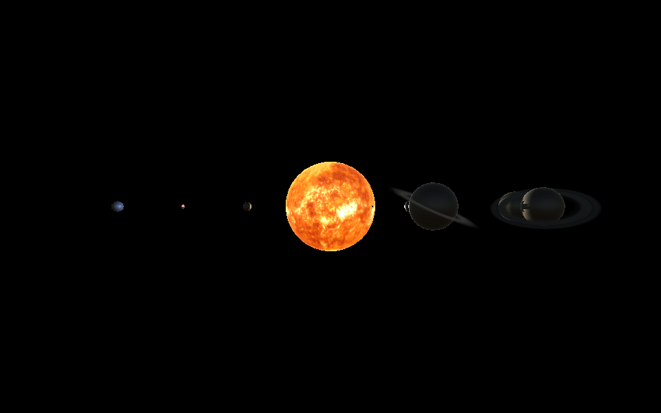

# Simulação - SistemaSolar
Por: [***Francisco Henrique***](https://www.linkedin.com/in/francisco-henrique-010912189)

### -Projeto desenvolvido utilizando á *Game Engine* [Unity](https://unity.com/) com C#.

## Objetivo
- Exibir um projeto que trabalha com física, Projeto 3D.

## Informações
- Este projeto é uma simulação 3D do Sistema Solar, criado na Unity com C#, e reproduz a localização de cada planeta em relação ao sol, sua rotação e sua velocidade.

## Para Executar:
* PC: Na pasta Executável-PC Rode o arquivo SistemaSolar.exe e ele abrirá em sua máquina.
* WEB: Na pasta Executável-WEB Rode o arquivo index.html e ele abrirá no seu navegador.
